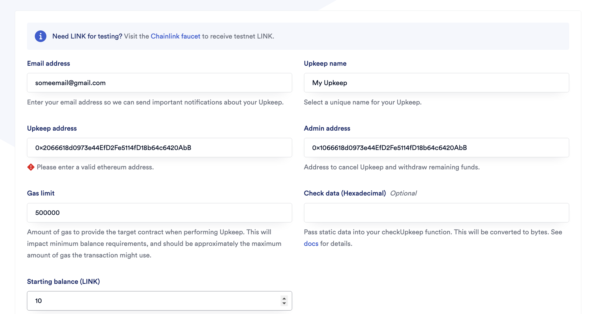

# Foundry Smart Contract Lottery

## Getting Started

### Requirements
- **Git**:
  - [Install Git](https://git-scm.com/book/en/v2/Getting-Started-Installing-Git)
  - Verify the installation by running:  
    ```bash
    git --version
    ```
    You should see a response like: `git version x.x.x`.

- **Foundry**:
  - [Install Foundry](https://getfoundry.sh/)
  - Verify the installation by running:  
    ```bash
    forge --version
    ```
    You should see a response like: `forge 0.2.0 (816e00b 2023-03-16T00:05:26.396218Z)`.

---

### Start a Local Node
To start a local node, use the following command:
```bash
make anvil
```

---

## Library
If you are having trouble installing the Chainlink library, you can run the following command:
```bash
forge install smartcontractkit/chainlink-brownie-contracts@0.6.1 --no-commit
```

---

## Deploy
### Deployment to Local Node
To deploy the smart contracts locally:
```bash
make deploy
```
Ensure that the local node (`anvil`) is running in another terminal window before executing this command.

---

### Deployment to Testnet or Mainnet
1. **Set Up Environment Variables**:
   - Add the following environment variables to your `.env` file (refer to `.env.example` for guidance):
     - `PRIVATE_KEY`: The private key of your account (e.g., from Metamask).  
       **Note**: For development purposes, use a key that does not hold real funds.
     - `SEPOLIA_RPC_URL`: The RPC URL for the Sepolia testnet. You can obtain it for free from [Alchemy](https://alchemy.com/).
     - Optionally, add `ETHERSCAN_API_KEY` if you want to verify your contract on [Etherscan](https://docs.etherscan.io/getting-started/viewing-api-usage-statistics).

2. **Get Testnet ETH**:
   - Obtain some testnet ETH from faucets:
     - [faucets.chain.link](https://faucets.chain.link/)
     - Or from [Google Cloud Faucet](https://cloud.google.com/application/web3/faucet/ethereum/sepolia)

3. **Deploy to Sepolia Network**:
   ```bash
   make deploy ARGS="--network sepolia"
   ```

   This command will automatically set up a Chainlink VRF subscription for you. If you already have a subscription, update it in the `script/HelperConfig.s.sol` file. It will also automatically add your contract as a consumer.

---

### Register a Chainlink Automation Upkeep
- Follow the [official documentation](https://docs.chain.link/chainlink-automation/compatible-contracts) if you need help.
- Go to [automation.chain.link](https://automation.chain.link/new) and register a new upkeep. Choose `Custom logic` as your trigger mechanism for automation.



---

## Scripts
After deploying to a testnet or local network, you can use scripts to interact with your smart contracts.

### Example Using `cast` Locally:
```bash
cast send <RAFFLE_CONTRACT_ADDRESS> "enterRaffle()" --value 0.1ether --private-key <PRIVATE_KEY> --rpc-url $SEPOLIA_RPC_URL
```

### Create a Chainlink VRF Subscription:
```bash
make createSubscription ARGS="--network sepolia"
```

---

## New Commands
### Call a Contract Function (Read-Only)
Use `make call` to read data from the contract without spending gas:
```bash
make call FUNCTION="getEntranceFee()"
```

### Send a Transaction (State-Changing)
Use `make send` to execute a function that modifies the blockchain state:
```bash
make send FUNCTION="enterRaffle()" VALUE=10000000000000000
```

### Read Contract Storage
Use `make storage` to read a specific storage slot:
```bash
make storage SLOT=0
```

### Monitor Contract Events
Use `make logs` to listen for contract events:
```bash
make logs
```

### Check Wallet Balance
Use `make balance` to check the balance of your wallet:
```bash
make balance
```

---

## Estimate Gas
To estimate gas costs:
```bash
forge snapshot
```
A `.gas-snapshot` file will be created containing the estimation results.

---

## Formatting
To format the code:
```bash
forge fmt
```

---

## Additional Info
### Is `chainlink-brownie-contracts` an Official Repository?
Yes, `chainlink-brownie-contracts` is an official repository maintained by the Chainlink team. It is specifically designed to provide packages suitable for use with Foundry.

#### What Does "Official" Mean?
- The official release process involves Chainlink publishing its packages to [npm](https://www.npmjs.com/package/@chainlink/contracts).
- You have two options:
  1. Download directly from npm (but this may result in dependencies incompatible with Foundry).
  2. Download from the `chainlink-brownie-contracts` repository, which downloads the packages from npm and packages them nicely for use with Foundry.

---

## Summary
1. `chainlink-brownie-contracts` is an official repository maintained by the same organization.
2. It downloads packages from Chainlink's official release cycle (npm) and prepares them for use with Foundry.

---

### Deployed on ETH SepoliaScan
[View on Etherscan](https://sepolia.etherscan.io/address/0xbf9f7b16ece875a4b3a311f2c2033de33e91ad27)
